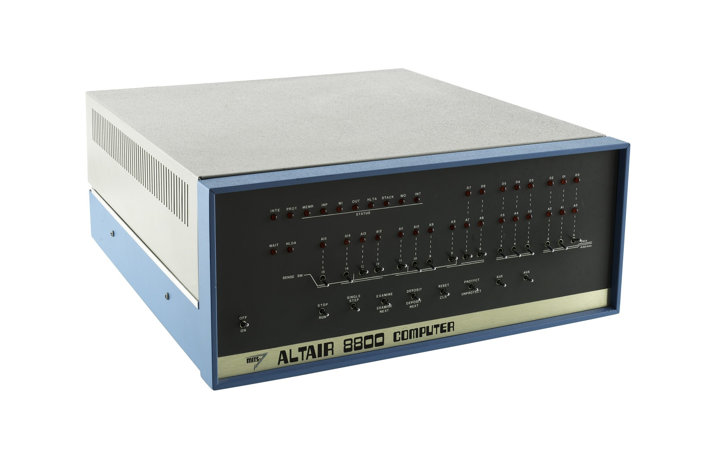

# Altair-8800-computer

#### the *altair 8800 computer* was the first ever commercial succesful personal computer. I was based on the intel 8080 Cpu which had ~~64 Kb of ram~~ and an `8bit microprocessor`. A kit cost $439 and two types of memory boards were available: a 1024-word memory board ($176) and a 4096-word memory board ($264). Later Roberts offered also a parallel interface board ($92), two types of serial interface boards, an audio cassette interface board and Teletype. Altair 8800’s expansion bus allowed MITS to sell additional memory and interface boards. The RAM provided was only 256 bytes and users had to purchase its memory board separately. The system came with 1024 bytes of storage but allowed to buy extra storage.

---

#### My own laptop is a lenovo laptop that I have had for a few months now and it costed 550jd.
* i7 11th gen with a base speed of 2.8GH and 4 cores
* Nvidia Geforce mx450 with 2gb of gpu memory and 
* 16gb of memory
* a 231gb ssd and a 931gb hdd

